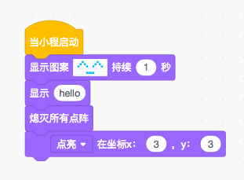

# 小程

**函数**

当小程启动时

    import codey

当接收到（message）

    def callback():
        pass
    codey.on_message(msgstr, callback)

广播 'hello'

    codey.message('hello')

**示例1**

    import codey

    codey.show('hello world')

**示例2**

    import codey

    def on_start_callback():
        codey.message('hello')

    codey.on_start(on_start_callback)

    def on_message_callback():
        codey.show('hello world')

    codey.on_message('hello', on_message_callback)


# 小奔

小奔是底盘，带有两个轮子和光线传感器。

**函数**

以 50 的动力前进，持续 1 秒

    rocky.forward(50, 1)

以 50 的动力后退，持续 1 秒

    rocky.backward(50, 1)

以 50 的动力左转，持续 1 秒

    rocky.left(50, 1)

以 50 的动力右转，持续 1 秒

    rocky.right(50, 1)


**示例**

```
    import rocky

    rocky.forward(50, 1)
    rocky.back(50, 1)
    rocky.left(50, 1)
    rocky.right(50, 1)
```


# 表情面板

表情面板是一个 8*16 的 led 矩阵。每一个 led 灯都可以通过 api 来控制

**函数**

显示图案【^_^】持续（1）秒

```
    codey.face(
        '0 0 0 0 0 0 0 0 0 0 0 0 0 0 0 0'
        '0 0 0 0 1 0 0 0 0 0 0 1 0 0 0 0'
        '0 0 0 1 0 1 0 0 0 0 1 0 1 0 0 0'
        '0 0 1 0 0 0 1 0 0 1 0 0 0 1 0 0'
        '0 0 0 0 0 0 0 0 0 0 0 0 0 0 0 0'
        '0 0 0 0 0 0 0 0 0 0 0 0 0 0 0 0'
        '0 0 0 0 0 0 1 1 1 1 0 0 0 0 0 0'
        '0 0 0 0 0 0 0 0 0 0 0 0 0 0 0 0', 1)
```

显示图案【^_^】

```
    codey.face(
        '0 0 0 0 0 0 0 0 0 0 0 0 0 0 0 0'
        '0 0 0 0 1 0 0 0 0 0 0 1 0 0 0 0'
        '0 0 0 1 0 1 0 0 0 0 1 0 1 0 0 0'
        '0 0 1 0 0 0 1 0 0 1 0 0 0 1 0 0'
        '0 0 0 0 0 0 0 0 0 0 0 0 0 0 0 0'
        '0 0 0 0 0 0 0 0 0 0 0 0 0 0 0 0'
        '0 0 0 0 0 0 1 1 1 1 0 0 0 0 0 0'
        '0 0 0 0 0 0 0 0 0 0 0 0 0 0 0 0')
```

显示图案【^_^】在坐标 x [0], y[0]

```
    codey.face_at(
        '0 0 0 0 0 0 0 0 0 0 0 0 0 0 0 0'
        '0 0 0 0 1 0 0 0 0 0 0 1 0 0 0 0'
        '0 0 0 1 0 1 0 0 0 0 1 0 1 0 0 0'
        '0 0 1 0 0 0 1 0 0 1 0 0 0 1 0 0'
        '0 0 0 0 0 0 0 0 0 0 0 0 0 0 0 0'
        '0 0 0 0 0 0 0 0 0 0 0 0 0 0 0 0'
        '0 0 0 0 0 0 1 1 1 1 0 0 0 0 0 0'
        '0 0 0 0 0 0 0 0 0 0 0 0 0 0 0 0', 0, 0)
```

显示 "hello world"

    codey.show('hello world')

熄灭屏幕

    codey.clear()

点亮x:(0) y:(0)

    codey.pixel(x, y)

熄灭x:(0) y:(0)

    codey.pixel_off(0,0)

**示例**



```
    import codey
    import time

    codey.face(
        '0 0 0 0 0 0 0 0 0 0 0 0 0 0 0 0'
        '0 0 0 0 1 0 0 0 0 0 0 1 0 0 0 0'
        '0 0 0 1 0 1 0 0 0 0 1 0 1 0 0 0'
        '0 0 1 0 0 0 1 0 0 1 0 0 0 1 0 0'
        '0 0 0 0 0 0 0 0 0 0 0 0 0 0 0 0'
        '0 0 0 0 0 0 0 0 0 0 0 0 0 0 0 0'
        '0 0 0 0 0 0 1 1 1 1 0 0 0 0 0 0'
        '0 0 0 0 0 0 0 0 0 0 0 0 0 0 0 0', 1)
    codey.show('hello')
    time.sleep(1)
    codey.clear()
    time.sleep(1)
    codey.pixel(3, 3)
```

# RGB LED 灯

在小奔的中间有一个 rgb led 灯，支持设置不同的颜色

**函数**

LED 亮起【红】，持续（1）秒

    codey.color('#334455', 1)

LED 亮起【红】

    codey.color('#334455')

熄灭 LED

    codey.color('#000')

设置LED的RGB值为红（255）绿（0）蓝 （0）

    codey.rgb(255, 0, 0)

**示例**

    import codey

    codey.color('#ff0000', 1)
    codey.color('#00ff15', 1)
    codey.color('#0021ff', 1)


# 扬声器


**函数**

播放声音【猫叫】。该次播放可被打断。

可选的参数如下：

- `hello.wav` : 哈喽
- `hi.wav` : 嗨
- `bye.wav` : 拜
- `yeah.wav` : 耶
- `wow.wav` : 哇哦
- `laugh.wav` : 笑声
- `hum.wav` : 哼唱
- `sad.wav` : 难过
- `sigh.wav` : 叹气
- `annoyed.wav` : 哼！
- `angry.wav` : 生气
- `surprised.wav` : 惊吓
- `yummy.wav` : 撒娇
- `curious.wav` : 好奇
- `embarrassed.wav` : 尴尬
- `ready.wav` : 准备
- `sprint.wav` : 冲刺
- `sleepy.wav` : 打呼
- `meow.wav` : 喵
- `start.wav` : 启动
- `switch.wav` : 开关
- `beeps.wav` : 哔哔
- `buzzing.wav` : 蜂鸣
- `exhaust.wav` : 排气
- `explosion.wav` : 爆炸
- `gotcha.wav` : 获取
- `hurt.wav` : 痛苦
- `jump.wav` : 跳动
- `laser.wav` : 激光
- `level up.wav` : 升级
- `low energy.wav` : 低能量
- `metal clash.wav` : 金属音
- `prompt tone.wav` : 提示
- `right.wav` : 正确
- `wrong.wav` : 错误
- `ring.wav` : 铃声
- `score.wav` : 得分
- `shot.wav` : 发射
- `step_1.wav` : 脚步声1
- `step_2.wav` : 脚步声2
- `wake.wav` : 激活
- `warning.wav` : 警告

    codey.say('hello.wav')

播放声音【猫】直到结束。该次播放，不会被打断

    codey.say('hello.wav', True)

停止声音

    codey.mute()

播放音符（60）以（0.25）拍。参照表待定。

    codey.play(435, 500)

停止（0.25）拍

    todo

播放声音以频率 (700) 赫兹持续 (1) 秒

    todo

调整音量（-10）

    codey.change_volume(-10)

将音量设定为（100）

    codey.set_volume(100)

音量

    codey.get_volume()


**示例**

    import codey

    codey.set_volume(100)
    codey.say('hello.wav', True)
    codey.say('hi.wav', True)


# 陀螺仪


**函数**

当小程摇晃

    def callback():
        pass
    codey.on_shake(callback)

当小程【向前，向后，向左，向右】倾斜。第一个参数可选项为：``forward``，``backward``，``left``，``right``。

    def callback():
        pass
    codey.on_tilt('forward',callback)


**示例**

    import codey

    def on_shake_callback():
        codey.color('#ff0000')

    codey.on_shake(on_shake_callback)


<!-- # 红外接收发射器
***

**函数**

**示例** -->


# 按钮


小程有三个按钮，分别为 ``A``, ``B``, ``C``。

**函数**

当按下按钮【A, B, C】

    def callback():
        pass
    codey.on_button('A', callback)

第一个参数可以为：``A``，``B``，``C``。


**示例**

    import codey

    def on_button_callback():
        codey.color('#ff0000')

    codey.on_button('A', on_button_callback)


# 齿轮电位器


**函数**

**示例**


# 光线传感器


**函数**

当光线强度＜（10）

    def callback():
        pass

    codey.on_light_under(50, callback)


**示例**

    import codey

    def on_light_under_callback():
        codey.color('#ff0000')

    codey.on_light_under(10, on_light_under_callback)


# 声音传感器


**函数**

当【响度】＞（10）

    def callback():
        pass

    codey.on_sound_over(10, callback)


**示例**

    import codey

    def on_sound_over_callback():
        codey.color('#ff0000')

    codey.on_sound_over(10, on_sound_over_callback)


# 通用语法-控制
****

**函数**

等待 1 秒

    import time
    time.sleep(1)

重复 10 次

    for count in range(10):
        pass

重复执行

    while True:
        pass

如果，那么

    if False:
        pass

如果，那么，否则

    if False:
        pass

    else:
        pass

等待直到

    while not False:
        pass

重复执行，直到

    while not False:
        pass

# 通用语法-运算
****

**函数**

1 加 1

    1 + 1

1 减 1

    1 - 1

1 乘 1

    1 * 1

1 除以 1

    1 / 1

在 1 到 10 之间随机取一个数

    import random
    random.randint(1, 10)

1 小于 2

    1 < 2

1 等于 1

    1 == 1

2 大于 1

    2 < 1

与

    False and False

或

    False or False

非

    not True

连接字符串 ``hello`` 与 ``world``

    str('hello') + str('world')

字符串 ``word`` 中的第一个字符

    'world'[0]

字符串 ``word`` 的长度

    len('world')

字符串 ``hello`` 是否包含字符串 ``world``？

    str('hello').find(str('world')) > -1

1 除以 3 的余数

    1 % 3

将 ``3.4`` 四舍五入

    round(3.4)

``-1`` 的绝对值

    import math
    math.fabs(-1)

将 ``3.4`` 向上取整

    import math
    math.ceil(3.4)

``4`` 平方根

    import math
    math.sqrt(4)

``2`` 的正弦

    import math
    math.sin(2 / 180.0 * math.pi)

``2`` 的余弦

    import math
    math.cos(2 / 180.0 * math.pi)

``2`` 的正切

    import math
    math.tan(2 / 180.0 * math.pi)

``2`` 的反正弦

    import math
    math.asin(2) / math.pi * 180

``2`` 的反余弦

    import math
    math.acos(2) / math.pi * 180

``2`` 的反正切

    import math
    math.atan(2) / math.pi * 180

``ln2``

    import math
    math.log(2)

``log2``

    import math
    math.log10(2)

``e^2``

    import math
    math.exp(2)

``10^2``

    import math
    math.pow(10,2)
