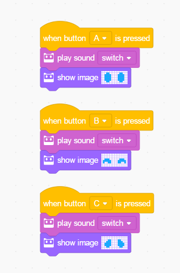
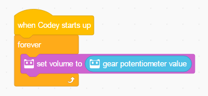
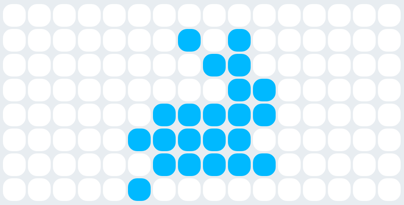

#  codey rocky +mblock 5 Quick Start Guide

>Document Version：v1.1
>
>Date：2018/2/2
>
>Written by：Breloom
>
>Support softwware and version：mblock5 Alpha.8

## Download

 For the latest version, please go to the following website:

[http://www.mblock.cc/software/mblock/mblock5/](http://www.mblock.cc/software/mblock/mblock5/)

## Interface and Glossary

Blocks Area ，Scripts Area，Stage Area

* Blocks Area: An area where blocks available for programming are provided. You can find any blocks that you need by category and color.

* Scripts Area: An area where blocks can be dragged here to write programs.
* Stage Area: In this area, you can display your works, connect the device, upload to the device, add sprites and backgrounds, etc.

## Examples Programs

Alpha.8 has 12 new examples programs. Some of the projects in this document can be found in Examples Programs as well.

## Connect Device

First, power on your codey. Next, connect the codey with a computer via the USB cable or the Bluetooth adapter.

1. Start the software mblock. Click Connect Device.

2. Click Connect.

Note: The COM3 here refers to the serial port number and it might vary from different systems and computers. Anyway, you can just click Connect.

## 1. Start with your First Project  ***（Beginner）***

1. Drag an Events Block to the Scripts Area.

2. Add a Sound Block and select a sound effect.

3. Click Upload to Device.

Press the Button A on codey and you will hear some sounds from codey.

4. Add the image block. You can choose the image by default, or you can draw up an image you like with your mouse.

5. Let’s draw up more images and control them with Button A, B, C.

> Tip: You can right-click the blocks to duplicate the scripts and right-click in the blank Scripts Area to rearrange all the blocks.

6. Upload the program to device and save the program.

7. Last step! Show your project to friends and families!

## 2.Make an Animation: Joggle Bouncy Balls  ***（Beginner）***

In this project, you will learn how to make an animation with codey and how to trigger it in a funny way:

1. The following block is needed in this project:

2. Open a New File. Then, draw a floppy ball. Make it just look like lie on the floor.

3. Keep on. Now, draw a ball that bounces up. Then, snap together this block and the former one, and set time to 0.3 sec.

4. Go on to finish the image. Draw up the entire process of bouncy ball from bouncing up to landing.

5. Add a sound and a trigger event.

6. Upload the program and shake codey. Now, what is happening?

By tying codey to your body, you can find that the bouncy ball will bounce up as you jump up.

> Tips:
> 1. You can use different Events to trigger the animation.
> 2. You can change the animation speed by adjusting the time duration.

## 3.Execute Simultaneously: Alarm ***（Beginner）***

A combination of the blocks can simply serves as a script. ***As for codey, it can execute six scripts at most simultaneously.***。

This program includes two scripts. One script is designed to make codey repeat the sound and another script is to make codey flash on and off, on and off...

> Tip: You can add one more scripts to control volume of codey with the gear potentiometer.
>
> 

> Note: You can find the gear potentiometer on the side of codey.
>
> 

## 4.Images Coordinates ***（Intermediate ）***

1. This demo uses the following blocks

You can use this block to display the images at any specified coordinate positions. To get the accurate coordinate, please refer to the top left-corner of the image.

> Tip: Open the Image Editor. Just click on the icon  “ ” to show the coordinates.

2. Try the following script and check how the program works.

## 5.Variable and Coordinate-Running Rabbit  ***（Advanced）***

Thanks Ekime for drawing up the rabbit image for us and helping the writer finish this project.

The Variables function can enable the image to move:

1. Create a Variable

In mblock 5, you can only name variables with Latin letters. Chinese characters are not supported, but you can name variables with English letters or pinyin.

2. Use the following block to draw up a rabbit.

3. Set the variable to the x coordinate of the image.

4. Add another script where the variable can be changed when a button is pressed. You can observe how the image changes and you can find that the rabbit will move out of the screen if the variable exceeds a certain value.

5. Now, finish the script. Rotate the images and change the coordinates. Look! The rabbit is running!

> Tip: Duplicate the image block and then make some changes of it. In this way, you can make an animation with minimal fuss.

## 6.Display Sensor Values ***（Intermediate）***

codey has sets of sensors and can thus detect environmental changes around, including volume, light, gesture, etc.You can get access to sensor values in the following two ways:

1. Please ensure that your device is well connected first. Then select the value that you want to get and show it on the Stage.

2. You can also use the script as below and show the sensor values on the screen of codey.

3. Upload the above-mentioned program to the device. Next, make some sounds to codey. Look, the value on the Stage and screen is changing.

> Tip: Add a Wait block in the Repeat block to slow down the value change on the screen.
>
> 

## 7.Volume Indicator ***（Intermediate ）***

With the image coordinate and the sound sensor, you can ensure a dynamic display of the volume on the codey screen:

1. Connect the device. Select the Volume block and check for the volume in the current environment( values may be different in other environments).

 

2. Use the following block to draw up a simple image.

3. Use the arithmetic blocks under the Operators block category to get the volume values.

4. Finish the program and upload it. Now you can yell at your codey and check if it works.

> Tip: You can regulate the value with the Multiple block while observing the volume change at the same time.
>
>

## 8.Avoid Obstacles ***（Advanced）***

If you want to get started with functions of rocky, you need to add the rocky extension in the mblock 5 first.

In this project, codey rocky and its sensor will be needed.codey rocky has an IR color sensor that can be switched forward or downward. In this project, you need to switch the IR color sensor forward as a way to detect the obstacles in front of codey rocky.

All the blocks for this sensor are tagged with a sensor icon.

1. The following block is needed in this project.

> Explanation: If an obstacle can be detected in front of the IR color sensor, the result for this block will be “true”, otherwise it will be “false”.

Receive IR Send IR

>Note: The fundamental principle for obstacles detection lies in the IR reflection. When obstacles detection is under way: the lighter the color of object is , the longer the distance is; the darker the color of object is, the shorter the distance is.

2. Finish the following program. You can place obstacles in front of codey rocky to observe how its face will change.

3. Complete the program. Ensure that codey rocky will move on when no obstacle is detected, and turn right when obstacles are detected.

## 9.Interact with Stage Sprites: Control Musical Instruments with Broadcast***（Intermediate）***

The Broadcast function can empower codey to communicate with sprites on the Stage. In this way, you can accomplish your interactive stage projects:

1. Create a New Message: When button A is pressed, broadcast A.

2. Add a sprite. The new sprite will show up in the Stage Area.

3. Click on the new sprite(drum) and make a program for it.

4. Click on codey and upload its program to the device. Then, if you press the button A, you can hear drumbeats from the sprite drum on the computer.

5. Similarly, you can add more musical instruments sprites. Let’s have a concert for Panda!

## 10.Communicate Variable and Gear Potentiometer  ***（Advanced）***

The Broadcast function is just one option. You can make codey interact with the stage by creating a communicate variable as well.

In this project, you can use the gear potentiometer of codey to change the sprite size:

1. Create a Communicate Variable

2. Set the Communicate Variable to the value of gear potentiometer.

3. Click on the sprite Panda and you will find the communicate variable shows up in the data area as well.

4. Set the sprite size to the communicate variable value.

5.Upload the program of codey to the device and click the green flag. Pluck the gear potentiometer and observe how the srite changes.

## Discuss and Share

Want to share with us your projects and skills? Please visit us at the official forum of codey rocky:

[http://forum.makeblock.com/](http://forum.makeblock.com/)
